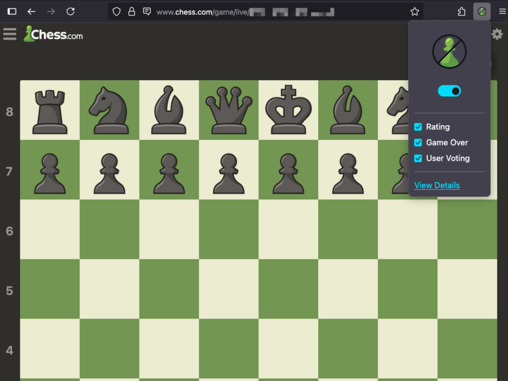

# Hide Chess.com Opponent  

A lightweight Firefox extension that hides your opponent on Chess.com while maintaining compliance with the [Acorns Design System](https://acorn.firefox.com/latest/acorn-aRSAh0Sp).

## How It Works

**Hide Chess.com Opponent** uses a [background script](https://developer.mozilla.org/en-US/docs/Mozilla/Add-ons/WebExtensions/Background_scripts) that listens for two key browser events. When these events are triggered, up to four small CSS files are injected into the active tab on Chess.com. Each file contains just 1–3 lines of CSS, ensuring negligible performance impact.

#### Events

- **[webNavigation.onHistoryStateUpdated](https://developer.mozilla.org/en-US/docs/Mozilla/Add-ons/WebExtensions/API/webNavigation/onHistoryStateUpdated):**  
  Chess.com uses a single-page application (SPA) architecture, meaning the URL changes without a full page reload. To detect new games or transitions, this event monitors those URL changes. Injecting CSS on every page would be inefficient and could lead to unwanted styling outside of gameplay views.

- **[storage.onChanged](https://developer.mozilla.org/en-US/docs/Mozilla/Add-ons/WebExtensions/API/storage/onChanged):**  
  The extension uses `storage.local` to save user preferences. When these preferences change—either via the [browser action](https://developer.mozilla.org/en-US/docs/Mozilla/Add-ons/WebExtensions/API/browserAction) or the dedicated [options page](https://developer.mozilla.org/en-US/docs/Mozilla/Add-ons/WebExtensions/user_interface/Options_pages) in Firefox’s extension manager—the script responds accordingly by updating the CSS injection behavior.

## Preferences

#### **_All preferences are enabled by default!_**

#### Preferences are configurable in the brower action or extension's preferences page.

- `enable` hides opponent username, avatar, rating, titles, badges, and flair. This setting allows users to quickly toggle the extension's scripts in real-time without managing the extension at `about:addons`.
- `postgame_rating` hides +/- rating change of opponent.
- `postgame_chat_gameover` hides gameover message in chatbox.
- `postgame_chat_vote` hides rate opponents sportsmanship in chatbox.

## Screenshots

## Usage

- Clone Repository
- Install dependencies with `npm i`.
- Start extension with `npm run dev`.

## Contributing

Fork repository and submit Pull Requests to `develop`.

## License

MIT License

> Copyright (c) [2025] [maxh1231]
>
> **Permission is hereby granted, free of charge, to any person obtaining a copy** > **of this software and associated documentation files (the "Software"), to deal** > **in the Software without restriction, including without limitation the rights** > **to use, copy, modify, merge, publish, distribute, sublicense, and/or sell** > **copies of the Software, and to permit persons to whom the Software is** > **furnished to do so, subject to the following conditions:**
>
> The above copyright notice and this permission notice shall be included in all
> copies or substantial portions of the Software.
>
> THE SOFTWARE IS PROVIDED "AS IS", WITHOUT WARRANTY OF ANY KIND, EXPRESS OR
> IMPLIED, INCLUDING BUT NOT LIMITED TO THE WARRANTIES OF MERCHANTABILITY,
> FITNESS FOR A PARTICULAR PURPOSE AND NONINFRINGEMENT. IN NO EVENT SHALL THE
> AUTHORS OR COPYRIGHT HOLDERS BE LIABLE FOR ANY CLAIM, DAMAGES OR OTHER
> LIABILITY, WHETHER IN AN ACTION OF CONTRACT, TORT OR OTHERWISE, ARISING FROM,
> OUT OF OR IN CONNECTION WITH THE SOFTWARE OR THE USE OR OTHER DEALINGS IN THE
> SOFTWARE.

---
