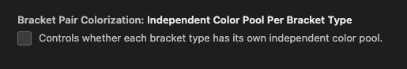

# Performance

With more explicit MutationObservers, we can reduce the number of event's were processing.

Unnecessary mutataions observed:

- Hovering Badge
- Hovering Title
- Hovering Flair
- Hover Connection

# SPA?

Extension is loaded on all (or most) chess.com routes. I think this may be required, if extension is not loaded on route prior to User's game, extension does not work properly until a page refresh. Whereas if the extension is loaded on prior route, it does work.

This means script running on all routes. A simple conditional for `document.location.href` may fix this. 

However, may be hard to distingush the user playing a game compared to other routes.

Route prior to User playing a game: `https://www.chess.com/play/online`

User against opponent games at `https://www.chess.com/game/*`. Need to distinguish this route somehow.
Spectateable high rated games at: `https://www.chess.com/game/*`

User games
- `div.board-layout-evaluation` exists? No until game ends
- `div.tabs-component` exists? Yes, but spectating has the "Watch tab"
- `div.evaluation-settings-component` exists? No until game ends

Spectating: 

div.tabs-component firstChild > span.tabs-label == 'Watch'?

# Game Over

#### chat box
When game ends, if user loses, opp's username displays in chat. It also reports the user's new rating as a textnode. Can extract this string. 

We want everything after \n. Can possibly pull a hardcoded index? NOPE data not static

I think it makes the most sense to get the new rating like so: 
`(div.game-over-message-component > a.user-username).nextSibling` replace its textContent with everything after the \n
then hide `(div.game-over-message-component > a.user-username)`

#### opp's tagline
Opp's rating and +- displays

can target this by `(div.player-component.player-top > div.player-tagline > player-game-over-component > span.rating-score-rating)

is this important?

# options insp

