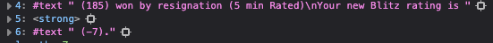

# Performance

With more explicit MutationObservers, we can reduce the number of event's were processing.

Unnecessary mutataions observed:

- Hovering Badge
- Hovering Title
- Hovering Flair
- Hover Connection

# SPA?

Upon starting a game from `https://www.chess.com/play/online`, script does not execute until a refresh.

- Route event listener?
- dom loaded event listener?

Route prior to User playing a game: `https://www.chess.com/play/online`

User against opponent games at `https://www.chess.com/game/*`. Need to distinguish this route somehow.
Spectateable high rated games at: `https://www.chess.com/game/*`

User games
- `div.board-layout-evaluation` exists? No until game ends
- `div.tabs-component` exists? Yes, but spectating has the "Watch tab"
- `div.evaluation-settings-component` exists? No until game ends

Spectating: 

div.tabs-component firstChild > span.tabs-label == 'Watch'?

# Game Over

#### chat box
When game ends, if user loses, opp's username displays in chat. It also reports the user's new rating as a textnode. Can extract this string. 

We want everything after \n. Can possibly pull a hardcoded index? NOPE data not static

I think it makes the most sense to get the new rating like so: 
`(div.game-over-message-component > a.user-username).nextSibling` replace its textContent with everything after the \n
then hide `(div.game-over-message-component > a.user-username)`
